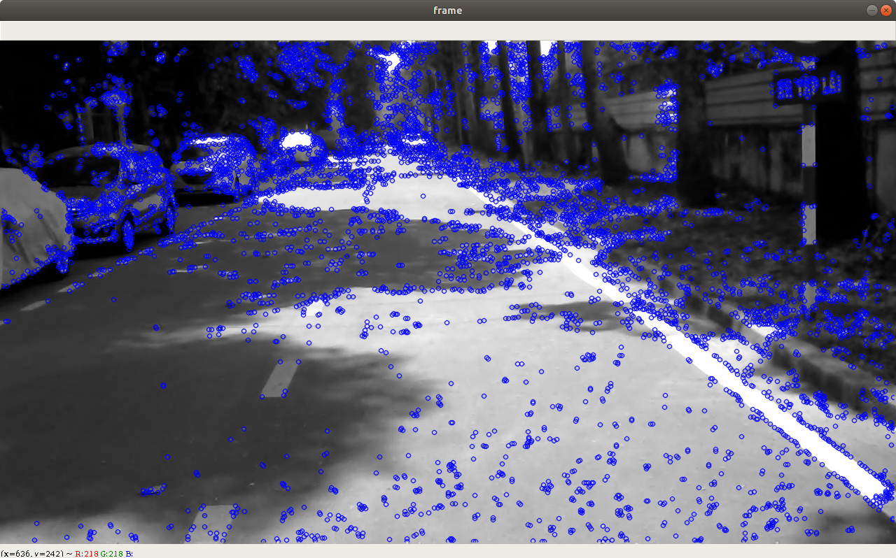

# Optical Flow
Video test: https://drive.google.com/file/d/10xzBH3hG21_A4IeWZ1g3uI9jLxM-T-Ov/view?usp=sharing

# SURF
## FPS: ~ 3.5-4.3

# FAST
## FPS: ~ 25-30
### Config:
* Threshold = 10
* Nonmax Suppression = True
* type = FastFeatureDetector::TYPE_9_16 (*16 is the total number of points on the arc, and 9 is the number of consecutive points actually detected. This corresponds to a radius of 3.*)

Take note: Chưa chạy được FAST cpp, chạy được FAST python.
